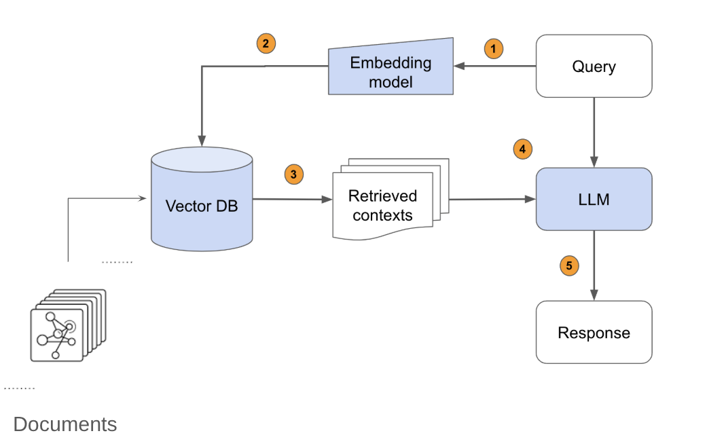

## 🧠 AI-Tutor

AI-Tutor is a RAG (Retrieval-Augmented Generation) pipeline designed to turn unstructured document collections into intelligent, queryable knowledge systems. It leverages modern LLM tooling for smart document ingestion, indexing, and frontend integration.

## ⚙️ How It Works

* **Document Conversion**
    - Input documents (in various formats) are parsed and converted into markdown files using Docling.

* **Vector DB Construction**
    - These markdown files are embedded and stored in a ChromaDB vector database.

* **RAG Application**
    - A LangChain-based pipeline is built to query the vector store using LLMs for intelligent response generation.

* **API Integration**
    - A FastAPI backend wraps the RAG logic for integration with the frontend application.

**Architecture Overview**



## 📦 Prerequisites

### System Requirements
- **Python 3.10+** (managed by conda)
- **Node.js 18+** (for frontend)
- **Anaconda3/conda** (for Python environment)
- **watchdog** (for file synchronisation) - `pip install watchdog`
- **rsync** (for file synchronisation):
  - Linux/Mac: Usually pre-installed
  - Windows: See setup instructions below

### Dependencies Setup
```bash
# Backend dependencies (one command)
cd AI-Tutor
conda env create -f environment.yml

# Activate environment (use the convenient script)
./run_sh.sh  # This handles module loading and conda activation

# Frontend dependencies (one command)  
cd ../AI-tutor-frontend/client
npm install
```

**Note:** The `environment.yml` and `package.json` files contain all exact dependency versions. You still need to install watchdog and Node.js separately.

## ⚙️ First-Time Setup

### For New Developers

1. **Contact your supervisor (or the University IT department) for your correct directory paths and server details before proceeding.**

2. **Copy configuration template:**
   ```bash
   cp config.env.template config.env
   ```

3. **Edit config.env with your details:**
   
   Update these values:
   - `BACKEND_DIR` - Your AI-Tutor backend directory path
   - `FRONTEND_DIR` - Your AI-tutor-frontend/client directory path  
   - `USERNAME` - Your Deakin username
   - `FRONTEND_SERVER` - Usually "ai-tutor.ai.deakin.edu.au"
   - `FRONTEND_HOST` - Usually "10.72.191.84"

4. **Set up SSH keys (Required for Development):**
   Development requires passwordless SSH between servers for automatic file synchronisation.

   ```bash
   # Generate SSH key (if you don't have one)
   ssh-keygen -t rsa -b 4096 -C "your-username@a100-f-01"
   
   # Copy key to frontend server (replace 'your-username' with your actual username)
   ssh-copy-id your-username@ai-tutor.ai.deakin.edu.au
   
   # Test passwordless SSH
   ssh your-username@ai-tutor.ai.deakin.edu.au "echo 'SSH working'"
   ```

   **Note:** Without this setup, the sync commands will fail with password prompts.

5. **Test the configuration is valid:**
   ```bash
   ./ai-tutor.sh
   ```

## 🔄 Development Workflow

### ⚠️ Important: Multi-Server Architecture
The system runs across two servers:
- **Backend:** a100-f-01 (accessed via Cisco Secure Client)
- **Frontend:** ai-tutor.ai.deakin.edu.au (remote web server)

Code changes must be synchronised between servers to appear in the browser. **Our rsync/watchmedo workflow handles this automatically.**

### Windows Users - Sync Setup Options:
**Note:** These options are untested but theoretically should work:

**Option 1 (Recommended): Use Windows Subsystem for Linux (WSL)**
```bash
# Install WSL if not already installed
wsl --install
# Then work within the WSL environment where rsync is available
```

**Option 2: Git Bash (if you have Git for Windows)**
- Git Bash includes rsync - the sync commands should work directly

**Option 3: Alternative sync method**
- If rsync is unavailable, you could modify the sync scripts to use `scp` instead

## 🚀 Quick Start

### Development Workflow (Recommended)
```bash
# 1. Start all services
./ai-tutor.sh full

# 2. In a second terminal, start file watcher for auto-sync
./start_watchmedo.sh

# 3. Make your code changes in your local IDE
# 4. Changes are automatically synced to the remote server
# 5. Refresh browser to see changes

# Access the application:
# 🌐 Frontend: http://10.72.191.84:5000
# 🔧 Backend: http://localhost:8000  
# 📚 API Docs: http://127.0.0.1:8000/docs

# Check status anytime
./ai-tutor.sh status

# Stop everything when done
./ai-tutor.sh stop
```

### Production/Demo Mode (no development sync)
```bash
# Start everything (persistent tmux sessions)
./ai-tutor.sh full

# Check status
./ai-tutor.sh status
```

### Backend Only (for testing)
```bash
# Backend only (persistent tmux)
./ai-tutor.sh backend

# Quick restart (no full model reload)
./ai-tutor.sh restart
```

### Manual Sync (if auto-sync not running):
```bash
./auto_rsync.sh        # One-time sync of all changes
./ai-tutor.sh frontend # Restart frontend to see changes
```

### Available Commands (Quick Reference)
```bash
# Main control script commands:
./ai-tutor.sh full     # Start all services (backend + frontend)
./ai-tutor.sh backend  # Start backend only
./ai-tutor.sh frontend # Start frontend only  
./ai-tutor.sh restart  # Quick backend restart (no model reload)
./ai-tutor.sh stop     # Stop all services  
./ai-tutor.sh status   # Show service status

# Development sync commands:
./start_watchmedo.sh   # Start automatic file watcher/sync
./auto_rsync.sh        # Manual one-time sync to remote server
```

**⚠️ Important:** 
- Backend startup may take minutes to load the 27GB microsoft/phi-4 model
- Services run in **persistent tmux sessions** - survive SSH disconnection
- Use `tmux attach -t ai-backend` to monitor backend startup progress
- Use `tmux attach -t ai-frontend` to monitor frontend

## 🔧 API Endpoints

### Interactive API Documentation
The FastAPI backend automatically generates interactive documentation in multiple formats:

- **Swagger UI** (`http://127.0.0.1:8000/docs`) - Interactive API explorer with testing capabilities
- **ReDoc** (`http://127.0.0.1:8000/redoc`) - Clean, responsive API documentation  
- **OpenAPI JSON** (`http://127.0.0.1:8000/openapi.json`) - Machine-readable API specification for tools and integrations

### Main Endpoints:
- **`GET /health`** - Health check and system status  
- **`POST /query`** - Main chat endpoint (requires `query`, `session_id`)
- **`GET /quiz/weeks`** - Get available quiz weeks
- **`POST /quiz/generate`** - Generate quiz questions for a week

## 🔧 Troubleshooting

### Frontend "Site can't be reached"
If frontend shows connection refused, check tmux session: `tmux capture-pane -t ai-frontend -p`. 
Common fix - reinstall npm on remote server:
```bash
ssh your-username@ai-tutor.ai.deakin.edu.au 'export NVM_DIR="$HOME/.nvm" && [ -s "$NVM_DIR/nvm.sh" ] && . "$NVM_DIR/nvm.sh" && nvm use 18 && cd /home/your-username/AI-Tutor_Deakin/AI-tutor-frontend/client && rm -rf node_modules && npm install'
```

### Common Issues
- **Password prompts during sync:** Set up SSH keys (see setup section)
- **Watchmedo fails:** `conda activate test_app && pip install watchdog`

## 🧪 Testing

```bash
# Activate environment and run tests
cd AI-Tutor && ./run_sh.sh
python run_tests.py

# Specific test categories
python run_tests.py --test memory performance gpu_stress
```

Test results are saved to `_my_tests/results/` with timestamps and excluded from git.

## 💾 Database Setup

### Initial Setup (Required for New Developers)
The vector database must be built locally (binary files not in git):

```bash
cd AI-Tutor && ./run_sh.sh
python docling_run.py --input-directory ./grouped_weeks --vector_db ./RL_db_reference_1k_500
```

### Database Components
- **Source documents:** `grouped_weeks/` (in git)
- **Processed documents:** `RL_db_reference_1k_500/*.md` (in git)
- **Vector database:** `RL_db_reference_1k_500/chroma.sqlite3` + UUID dirs (ignored by git)